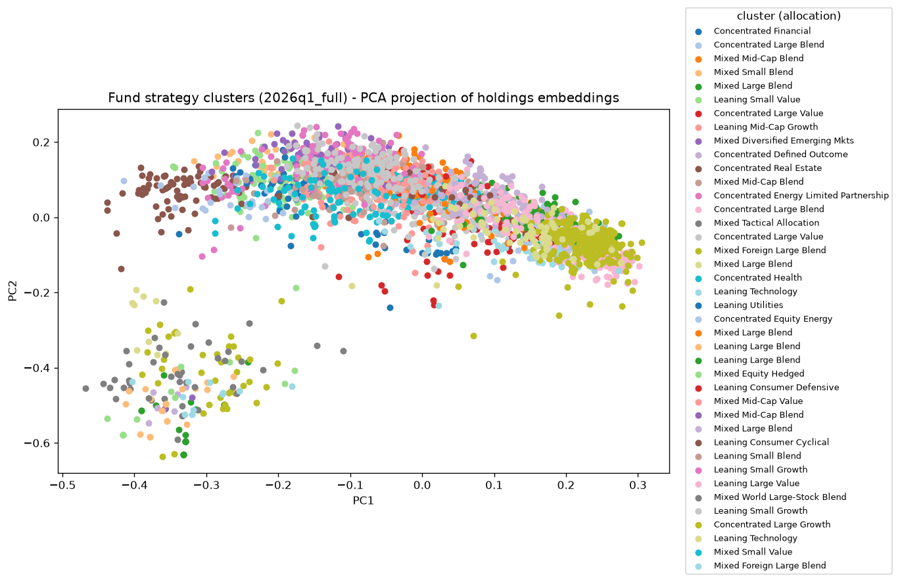

# FundsPeersStrategy

**Can peer groups built from what funds actually hold predict which funds will underperform their peers next quarter — better than a naive rule?** This project groups US equity mutual funds into strategy peer groups from their SEC N-PORT holdings, trains a model to flag the funds likely to fall below their peer group's median return next quarter, and then does the thing most backtests skip: it commits predictions in advance and scores them against what actually happened.

The honest headline, leading with the number that matters most:

- **Backtest AUC 0.717** (`_all` universe, 2,243 funds, 2024 in-sample test) — looks strong.
- **Reality AUC 0.574** — the dashboard's 2,086 predictions for 2024q4 → 2025q1, committed before the fact, scored against what really happened (2,057 funds scored, base rate 0.532). Real signal, clearly above a coin flip, but far below the backtest.
- **The signal is mean reversion.** The naive "persistence" rule (a fund below its peers this quarter stays below next quarter) scores *below* 0.5 — peer-relative returns mean-revert. The honest yardstick is *reversed* persistence (bet on mean reversion), and the model barely clears it: retrained on the full universe it scores 0.614 [0.605, 0.623] vs the mean-reversion rule's 0.604. The random forest has largely learned that one-line rule.
- **Fees help, a little.** Adding point-in-time expense ratios and portfolio turnover: the with-fees model scores 0.619 [0.610, 0.629] against the no-fees 0.615 on the same covered subset - a statistically solid, economically small lift (paired edge [+0.003, +0.006], p=0.000).

This is a project that says the signal is thin and then proves *how* thin.

## The peer-group map



*Each dot is a US equity fund, positioned by a PCA projection of its holdings-text embedding and colored by its strategy cluster (2026q1, full universe, k=40). Cluster names are allocation-only labels (e.g. "Leaning Large Blend", "Concentrated Real Estate") derived from each cluster's dominant Yahoo category — deliberately never from performance, since the clusters are formed from holdings similarity, not returns.*

## What's inside

- **3,231 US equity funds**, including **611 that died mid-window** — their final (often worst) quarters stay in the panel, which structurally reduces survivorship bias rather than papering over it.
- **17 quarters, 2022–2026**, built from the SEC's bulk **Form N-PORT Data Sets** (quarterly ZIPs of flat files — no XML scraping, no paid vendors).
- **Holdings-embedding peer groups**: each fund's top holdings are turned into a text description, embedded locally (`all-MiniLM-L6-v2`), and clustered with KMeans (k=40). Chosen by measurement — raw issuer-overlap vectors scored at chance against independent fund categories (ARI 0.01–0.07); text embeddings raised agreement ~10x (ARI ~0.25).
- **kNN-peer labels**: "underperform" means falling below the median next-quarter return of a fund's own top-10 most-similar peers — a bespoke, constant-size benchmark that doesn't silently change meaning as the universe grows.
- **Random forest + a Monte Carlo uncertainty layer** — bootstrap confidence intervals, a paired significance test of the edge over the naive rule, and a label-noise floor study.
- **Point-in-time fees & turnover** from the SEC DERA Risk/Return Summary datasets (as-filed, dated — no look-ahead).
- **A phi-4-narrated dashboard** (local LLM, grounded in computed data only) and **quarterly auto-refresh**.

## Headline numbers

Every row is labeled by universe and window, because they are **not** interchangeable: the 0.717 backtest and the sub-0.62 out-of-time numbers come from different universes, cluster counts, and test periods. The drop from 0.717 to 0.574 is the backtest meeting reality — not fees hurting the model.

| Scorer | AUC | Universe / window |
|---|---|---|
| **Backtest (unified model)** | **0.717** [0.703, 0.729] | `_all`, 2,243 funds, k=30, 2024 in-sample test |
| **Committed predictions vs reality** | **0.574** | 2,086 published 2024q4→2025q1 predictions, scored on realized 2025q1 |
| Frozen model rolled forward | 0.603 | `_full`, 2025q1–q4 out-of-time (11,602 rows) |
| **Retrained (unified model)** | **0.614** [0.605, 0.623] | `_full`, 3,231 funds, k=40, 2025 out-of-time test |
| **Retrained + fees/turnover** | **0.619** [0.610, 0.629] | `_full`, same covered subset |
| *Baseline:* random | 0.500 | — |
| *Baseline:* persistence | 0.396 | `_full` — below 0.5: returns mean-revert |
| *Baseline:* **reversed persistence** (mean-reversion rule) | **0.604** | `_full` — the honest yardstick to beat |
| *Baseline:* expense-rank (higher fee → predicted underperformer) | 0.527 | `_full` — fees genuinely predict, weakly |

Read the arc top to bottom: a 0.717 backtest degrades to **0.574 on genuinely committed predictions**, and once retrained honestly on the larger, dead-fund-inclusive universe the model lands at 0.614 — a sliver above the 0.604 mean-reversion rule it has mostly learned. Fees widen that sliver: the paired edge over the mean-reversion rule becomes [+0.010, +0.021], p=0.000 - real beyond noise, if modest.

- **Per-quarter spread is wide.** The retrained model's AUC swings 0.453–0.748 across the five 2025 test quarters; a single pooled number overstates the precision.
- **The regime flips.** On the 2025q4 → 2026q1 transition the model scores **0.453 — below chance** — mean reversion itself inverted (raw persistence 0.551 beat the model there). Fees do not fix this.
- **Label-noise floor ~8.3%.** Perturbing each fund's peer set, the underperform label flips on >10% of draws for 22.1% of fund-quarters (n≈40,808) — an intrinsic ceiling on any achievable AUC.
- **Fund-disjoint checks: 0.603 (no fees), 0.614 (with fees).** Trained and tested on completely separate sets of funds — within a hair of the pooled numbers, so the edge is not fund-identity memorization.

## Example narration

phi-4 (running locally via LM Studio) writes these; it is handed only the computed facts for a cluster and forbidden from using outside knowledge, so every number traces to a table. Two real cached examples from the dashboard:

> The "Leaning Large Blend" cluster consists of 127 US equity mutual funds, with a majority (53%) categorized as Large Blend funds. These funds exhibit an average annualized volatility of 16.6%... The average Sharpe ratio stands at 0.41... they experience an average maximum drawdown of -22.0%... Microsoft Corp is the most heavily weighted stock across the cluster's members, averaging 2.4% of portfolio weight, followed by Apple Inc at 1.6%. Other notable holdings include Alphabet Inc, Accenture PLC, Visa Inc, and NVIDIA Corp...

> The "Mixed Diversified Emerging Markets" cluster comprises 12 mutual funds, with a significant focus on diversified emerging markets... an average annualized volatility of 18.4%... The average Sharpe ratio stands at 0.11... an average maximum drawdown of -25.4%... A notable characteristic within this cluster is the unanimous investment in Dimensional Fund Advisors, which holds a dominant position with an average weight of 100% across all member funds.

*(Counts reflect the 2,243-fund dashboard universe. The LLM only verbalizes numbers the pipeline already produced — it never labels, decides, or predicts.)*

## Limitations

Stated plainly, because thin signal honestly reported is the whole point.

- **Survivorship bias — reduced, not eliminated.** The relaxed-completeness rule keeps 611 dead funds' final quarters in the panel. What remains: funds that died *before* 2022, and funds absent from the current SEC ticker map (both invisible to this data).
- **Category look-ahead — LOW.** Today's Yahoo category is stamped onto 2022–2026 history. It enters the model only as tier dummies (~3.6% importance), so the effect is small — but it is a look-ahead.
- **Yahoo categories are a noisy validator, not truth.** `yfinance` is an unofficial scraper; categories are used to sanity-check clusters, never as ground truth.
- **Label-noise floor ~8%.** The underperform label is intrinsically noisy (peer-set perturbation flips it for ~22% of fund-quarters on >10% of draws), capping achievable AUC.
- **Regime sensitivity.** The model learned a 2024 mean-reversion regime that weakened through 2025 and inverted by 2025q4, where the model scored 0.453 — below chance. Performance is regime-dependent, full stop.
- **Thin edge over a one-line rule.** even with fees, the paired edge over reversed persistence is [+0.010, +0.021] — the model matches, and only barely beats, a single hand-written mean-reversion rule. It beats a coin flip; it is not a large independent edge over a competent naive analyst.

## Quickstart

Three commands (needs Python 3.11+, a free [SEC User-Agent](https://www.sec.gov/os/webmaster-faq#developers), and — for narration — [LM Studio](https://lmstudio.ai/) serving phi-4 locally):

```bash
# 1. Set up the environment and credentials
cp .env.example .env   # then fill in SEC_USER_AGENT (e.g. "FundsPeers you@example.com")
pip install -r requirements.txt

# 2. Run the core pipeline end-to-end (ingest → similarity → metrics → predict → narrate)
python conductor.py

# 3. Build the dashboard (drop --skip-narratives to regenerate phi-4 narrations)
python -m steps.step8_dashboard.build --skip-narratives
```

Then explore:
- **`reports/cluster_dashboard.html`** — the interactive fund/cluster dashboard (self-contained, offline).
- **`reflection.html`** — the browser-readable decision log.
- **`techniques.json`** — why each method was chosen.
- **`plan.md`** — the contract: question, data sources, acceptance criteria.
- **`steps/step7_unified_universe/design.md`**, **`steps/step10_full_universe/design.md`**, **`steps/step9_fees_turnover/design.md`** — the honest UAT findings behind the headline numbers.

## Why these methods

Distilled from `techniques.json`:

- **Random forest, not deep learning.** A ~40k-row tabular panel with a noisy financial label is exactly where tree ensembles win — nonlinear interactions without scaling assumptions, native feature importances for a financial audience, and measurably less overfitting than a single tree (0.638 → 0.717 on the same split). A neural net buys nothing at this size and costs the explainability.
- **A local LLM behind a hard RAG boundary.** phi-4 (quantized, via LM Studio) is fed every fact it may use — retrieved from the pipeline's own tables — and forbidden the rest. Classical ML produces every number and decision; the LLM only turns them into English. Verified claim-by-claim against the source tables, with zero invented numbers.
- **Monte Carlo as an honesty layer, not a return simulator.** Simulating fund returns would mean *assuming* a return-generating process — replacing measured patterns with analyst assumptions. Instead MC quantifies uncertainty *in the evaluation*: a bootstrap CI on the headline AUC, a paired significance test of the edge over the naive rule, and the label-noise floor study.
- **Clusters validated against an independent label.** Internal cohesion metrics (silhouette, inertia) can be optimized by any clustering. Scoring against third-party fund categories (via chance-corrected adjusted Rand index) is a check the clustering cannot game.
- **kNN-peer median labels, not cluster-median.** "Below your cluster's median" silently degraded as the universe grew (12 close peers became 60+ heterogeneous ones). Defining the benchmark as each fund's own top-10 cosine peers makes it constant-size by construction — the root-cause fix, not a per-population patch.
